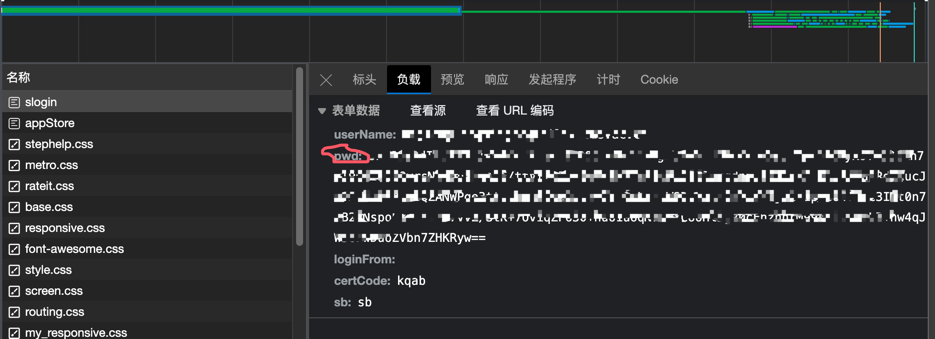
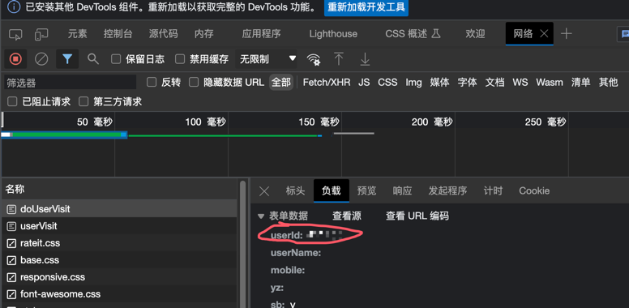

# UCAS Enroll Helper

## Original Repo
https://github.com/amefumi/UCAS-enroll
## Original Repo 2
https://github.com/LyleMi/ucas
## Init

Create a file named `auth` and fill in your username and password for SEP. Example:
```
username@mails.ucas.ac.cn
```

```
pwd(capture in browser as picture above)
```

```
your_user_id(capture in browser as picture above in https://sep.ucas.ac.cn/user/userVisit)
```

The first line stands for username and the second line stands for RSA of password.

It is recommonded that you should get your RSA of password using an F12 tool (in Chrome or Edge). It's named `pwd` in your `slogin` POST.

Create a file named `courseid` and fill in your willing course's ID. Example:

```
091M5023H,xx学院
091M4002H
```

`xx学院` is optianal. Course ID and department name should be seperated by `,` (English Comma).

### Examples for Department Name:
- 数学学院
- 物理学院
- 天文学院
- 化学学院
- 材料学院
- 生命学院
- 地球学院
- 资环学院
- 计算机学院
- 电子学院
- 工程学院
- 经管学院
- 公管学院
- 人文学院
- 马克思主义学院
- 外语系
- 中丹学院
- 国际学院
- 存济医学院
- 体育教研室
- 微电子学院
- 未来技术学院
- 网络空间安全学院
- 心理学系
- 人工智能学院
- 纳米科学与技术学院
- 艺术中心
- 光电学院
- 创新创业学院
- 核学院
- 现代农业科学学院
- 化学工程学院
- 海洋学院
- 航空宇航学院
- 杭州高等研究院

## Usage
Run command:

 ``python enroll.py -c`` 

## Update
4, Sep, 2023

modify the helper.py function to adapt the change of captcha in slogin 

4, Jan, 2023:

`ddddocr` is used to fill in the captcha when logining and selecting courses.

## Why do this update

Today, almost all universities choose courses by lottery, UCAS still chooses courses by snatching courses, which introduces too many other factors for course selection, especially the quality of the network and the probability of various errors randomly generated by the server. It is hoped that UCAS will change to the lottery method for course selection as soon as possible.